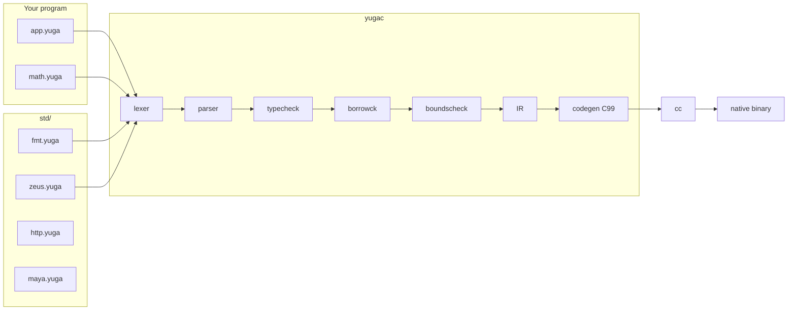

# Yuga language

Yuga is a memory-safe systems language: Odin-like syntax, Rust-like ownership.
`yugac` is written in C11, typechecks a program, lowers it to IR, emits C99,
and invokes `cc`. C is the **platform binding target**, not the language's
semantics.

Language rules live in [spec.md](spec.md). C vs Yuga: [boundary.md](boundary.md).
This file is architecture plus how to write and run programs.

## Architecture



Pipeline, in order:

| Stage | Where | What it does |
|---|---|---|
| Load | `src/compile.c` | Resolve `import "std:bar"` → `std/bar.yuga`, relative `"path.yuga"` from the importer. Cycles are errors. |
| Lex / parse | `src/lexer.c`, `src/parser.c` | Tokens → AST. |
| Typecheck | `src/sema/typecheck.c` | Names, types, auto-borrow, generics (monomorphized, including nested calls and defaults), `mod.fn` / `mod.global`, method rewrite `n.w(32)` → `zeus.w(n, 32)`. |
| Borrowck | `src/sema/borrowck.c` | Exclusive vs shared, moves, place paths (`p.a` vs `p.b`). |
| Boundscheck | `src/sema/boundscheck.c` | Proven in-range indexes skip the runtime trap. |
| IR | `src/ir.c` | CFG, drops, closures as heap env + fn pointer (`yuga_fn`: fn, env, env_size). |
| C | `src/codegen_c.c` | C99, then `cc`. |

Ownership state (from the spec):

```
Owned ──copy──► Owned
Owned ──move──► Moved
Owned ──&────► Borrowed ──end──► Owned
Owned ──&mut─► MutBorrowed ──end──► Owned
Owned ──scope exit──► Dropped   (free boxes / []T / closures)
```

`Box<T>` is not Copy. `[]T` is Copy when `T` is Copy (refcounted buffer,
copy-on-write on `push`). `fn` values are Copy handles. They are freed when
the last owner drops (vectors) or interned for the process (handlers).

## Repository map

```
yuga/
  packages/
    compiler/       compiler (C11) + language libraries + runtime + its own tests
      src/          compiler (C11)
      std/          language libraries (Yuga)
      runtime/      yuga_rt (language) + host shims (not library protocol C)
      tests/        compile_pass / compile_fail / golden (fixtures w/ .expected)
    zeus/           Zeus UI + hosts: desktop/ Cocoa, ios/ UIKit, android/ Canvas, web/ Canvas2D
    tree-sitter-yuga/  grammar
    editors/        editor integrations (Zed, Cursor/VS Code)
  examples/
    language/       standalone demo .yuga programs (not test fixtures)
    zeus/           zeus apps (gallery, dashboard) + full-stack counter example
  bin/yugac       the compiler
  bin/yuga-lsp    editor diagnostics / hover (incl. doc comments) / go-to-def / completion / semantic tokens
```

Std modules today: `fmt` (print), `zeus` (UI), `http`, `maya` (tiny 3D).

Document them with `///` above each `fn` / `struct` and `//!` at the top of the
file. Hover in the editor shows those comments plus the type.

## How to use the language

Build the compiler once from the repo root:

```
make
```

### 1. Hello

`hello.yuga`:

```yuga
import "std:fmt"

fn main() {
    fmt.println("hello, yuga")
}
```

```
./bin/yugac hello.yuga -o hello
./hello
```

`fmt.println` is compile-time lowering to length-based writes. It is not
`printf`.

Useful flags:

```
./bin/yugac app.yuga -o app          # binary
./bin/yugac app.yuga --emit-c -o a.c # C99
./bin/yugac app.yuga --emit-ir -o a.ir
./bin/yugac app.yuga --run           # compile and run
./bin/yugac app.yuga --target wasm -o app.wasm  # Canvas2D .wasm (clang wasm32)
./bin/yugac --target=ios --run examples/zeus/dashboard/dashboard.yuga  # Simulator
./bin/yugac --target=android examples/zeus/counter/android/app.yuga  # Gradle project
```

### Compile time

`yugac` itself is fast (tens of milliseconds to typecheck and emit C). Linking
a Zeus app is where the seconds go: generated C is hundreds of kilobytes, and
on macOS a GUI build also compiles Cocoa.

What `yugac` does about that:

- Runtime files (`zeus_plat.c`, `zeus_key.c`, `packages/zeus/desktop/mac.m`) compile once into
  `packages/compiler/runtime/.obj/` and are reused until those sources change.
- `ZEUS_HEADLESS=1` (tests) skips Cocoa and uses `-O0` on generated C.
- GUI builds use `-O1` on generated C, not `-O2` (same overflow checks,
  much less optimizer work).

Set `YUGA_TIME=1` to print `check` / `codegen` / `cc` timings on stderr.

`--target wasm` emits a Canvas2D `.wasm` (no WebGPU). Apple `/usr/bin/clang`
has no `wasm32` target; use Homebrew LLVM and `YUGA_WASM_CC`. See
`packages/zeus/docs/spec.md`.

`--target ios` builds an iOS Simulator `.app`. Zeus still paints its own
theme (fill / text / clip / SVG). UIKit is only the window and touch
host — not buttons, navigation bars, or iOS semantic colors. The
dashboard is a full-screen canvas; `zeus.App` size is ignored. Needs
Xcode. Device signing is out of scope.

`--target android` writes a Gradle project that links a JNI Canvas host
the same way: Zeus paints; Android widgets are not used. Layout is in
density-independent pixels. `--run` needs the Android SDK, NDK, Gradle
8.2+, and `adb`. The counter example talks to the Mac backend at
`10.0.2.2:8080` from the emulator.

### 2. Structs, borrows, heap

```yuga
import "std:fmt"

struct Counter {
    name: string,
    count: int,
}

fn increment(c: &mut Counter) {
    c.count += 1
}

fn greet(c: &Counter) {
    fmt.println("hello,", c.name)
}

fn main() {
    let mut c = Counter { name: "tick", count: 0 }
    increment(&mut c)     // explicit
    increment(c)          // auto-borrow as &mut
    greet(c)              // auto-borrow as &
    let b = Box::new(42)
    fmt.println("boxed:", *b)
}
```

`let` is immutable, `let mut` is mutable. Passing an owned place to a `&T` /
`&mut T` parameter inserts the borrow. Stored borrows last until that binding
leaves scope (not NLL).

### 3. Arrays and generics

```yuga
import "std:fmt"

fn sum(xs: &[]int) -> int {
    let mut s = 0
    for i in 0..xs.len {
        s += xs[i]
    }
    return s
}

fn main() {
    let mut v = []int {}
    push(v, 10)
    v.push(20)
    fmt.println(sum(v))
}
```

`[]T` is a growable vector (`push` / `pop` / `.len`). Copy when `T` is Copy
(refcount on the buffer; `push` copy-on-writes if shared). Index traps unless
the compiler proved the index in range. `struct Pair<T> { a: T, b: T }` is
monomorphized; `Pair { a: 1, b: 2 }` infers `Pair<int>`.

`int` is `int64_t`. `+ - *` trap on overflow; use `wrapping_add` /
`saturating_add` / `wrapping_shr` / `wrapping_shl` / `wrapping_or` /
`wrapping_and` when wrap is intended. `s[i]` is the unsigned byte at `i`.

### 4. Modules

Quoted imports only. No glob, no `use`.

| Spec | Loads | Call as |
|---|---|---|
| `import "std:fmt"` | `std/fmt.yuga` | `fmt.println(...)` |
| `import "math.yuga"` | `math.yuga` next to this file | `math.add(2, 40)` |
| `import "../mod/math.yuga"` | relative to the importer | `math.add(...)` |

The module name is the file stem (`math`), or `bar` from `std:bar`.

Functions: `mod.fn(...)`. Module-level `let` bindings are places:
`counter.n += 1`.

`lib.yuga`:

```yuga
let mut n: int = 0

fn bump() {
    n += 1
}
```

`app.yuga`:

```yuga
import "std:fmt"
import "lib.yuga"

fn main() {
    lib.bump()
    lib.bump()
    fmt.println(lib.n)
}
```

Method call `node.w(32)` looks up `w` in the current file, then in imported
modules, and rewrites to `zeus.w(node, 32)` when `w` lives in `zeus`. That is why
`import "std:zeus"` is enough for widgets and trailing blocks.

### 5. Closures

```yuga
fn main() {
    let add = |a: int, b: int| { a + b }
    let n = add(2, 40)
}
```

Captures must be Copy. `fn` values are Copy handles (shared env). They may be
returned or stored. Zeus intern (`plat_intern_fn`) memcpy's that env using
`env_size`, so a click handler still sees captured `Signal`s after the stack
frame that created the closure is gone.

### Use cases

| You want | Start with |
|---|---|
| A CLI or algorithm | `import "std:fmt"`, `fn main()` |
| A desktop UI | [zeus.md](zeus.md) — `import "std:zeus"` |
| A tiny RPC server | `import "std:http"` (`examples/language/http_server.yuga`) |
| A 3D/2D toy scene | `import "std:maya"` (`examples/language/solar.yuga`) |

Corpus you can compile as examples:

- `packages/compiler/tests/compile_pass/hello.yuga`, `vec.yuga`, `globals.yuga`, `import_math.yuga`
- `examples/language/counter.yuga`, `fib.yuga`, `http_server.yuga`
- Failures the checker must reject: `packages/compiler/tests/compile_fail/*.yuga`

```
make && make test
```
